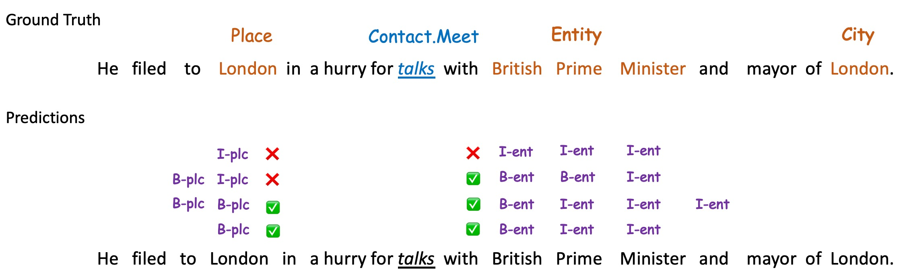
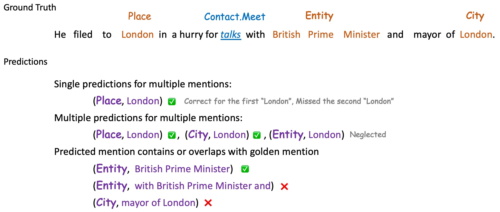
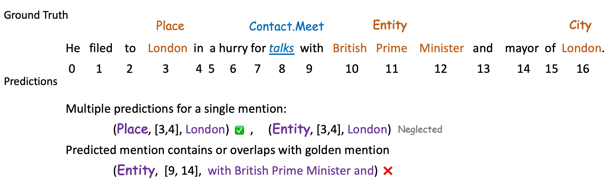

# Evaluation Module

## Background
Event Extraction (EE) is a challenging task and has captured broad attention from the community. However, there are two 
main issues regarding the evaluation process: 

- **Uncomparable Metrics Across Paradigms**

	Various Event Extraction (EE) models follow different **paradigms**, such as **Token Classification**, **Sequence Labeling**, **Seq2Seq** and **MRC**. The previous evaluation metrics are often paradigm-dependent. For example, in EAE methods of the Token Classification paradigm, we often choose the entities as the candidates for event arguments, but methods of the Seq2Seq paradigm may not respect the entity boundary. Therefore, it is actually ***not fair*** to directly compare the evaluation results of different paradigms.

- **Inconsisent scope of EAE Evaluation**

	Previous works tend to break Event Extraction into two subtasks: **Event Detection (ED)** and **Event Argument Extraction (EAE)**. When evaluating the performance of EAE, some people use the gold triggers as the input, while others may choose the predicted triggers produced by ED models. Moreover, there is no standard convention of how to deal with the incorrectly predicted triggers, which leads to the inconsistent scope of instances that are considered when evaluating EAE.

## Unified Evaluation
OmniEvent provides a unified evaluation process to tackle the issues above.

### Convert the predictions of different paradigms to a unified candidate set
	
The predictions of different paradigms are converted to predictions on a unified candidate set. In another word, we align the predictions to the candidates of the Token Classification paradigm (words for ED, entities for EAE if the entities are annotated) and compute all the evaluation metrics in the Token Classification style. Implementations of the conversion function can be found in [convert_format.py](./convert_format.py).

- **Convert Sequence Labeling to Token Classification**
  

  

- **Convert Seq2Seq to Token Classification**
  

  

- **Convert MRC to Token Classification**
  

  

    
### Provide four standard EAE evaluation modes

OmniEvent provides four evaluation modes for EAE according to the way of choosing EAE instances, which are used in previous works.

- <a id="gold">Gold Mode </a> 
  - Use the gold triggers for EAE.
- <a id="default">Default Mode </a> 
  - Use the predicted triggers for EAE.
  - Skip the gold positive (non-NA) triggers that are predicted as negative (NA).
  - Include the gold negative triggers that are predicted as positive
- <a id="loose">Loose Mode </a> 
  - Use the predicted triggers for EAE.
  - Skip the gold positive triggers that are predicted as negative.
  - Skip all gold negative triggers.
- <a id="strict">Strict Mode </a>
  - Use the predicted triggers for EAE.
  - Include all gold positive triggers.
  - Include all gold negative triggers that are predicted as positive.

## Unified Evaluation Results

We implement and evaluate state-of-the-art methods on some popular benchmarks using OmniEvent. 
The ***unified evaluation*** results along with the ***paradigm-dependent*** results can be accessed via the links below.

- [Experiments of base models on <u>**All ED Benchmarks**</u>](https://docs.qq.com/sheet/DRW5QQU1tZ2ViZlFo?tab=qp276f)
- [Experiments of base models on <u>**All EAE Benchmarks**</u>](https://docs.qq.com/sheet/DRW5QQU1tZ2ViZlFo?tab=b0zjme)
- [Experiments of <u>**All ED Models**</u> on ACE-EN+](https://docs.qq.com/sheet/DRW5QQU1tZ2ViZlFo?tab=odcgnh)
- [Experiments of <u>**All EAE Models**</u> on ACE-EN+](https://docs.qq.com/sheet/DRW5QQU1tZ2ViZlFo?tab=jxc1ea)
