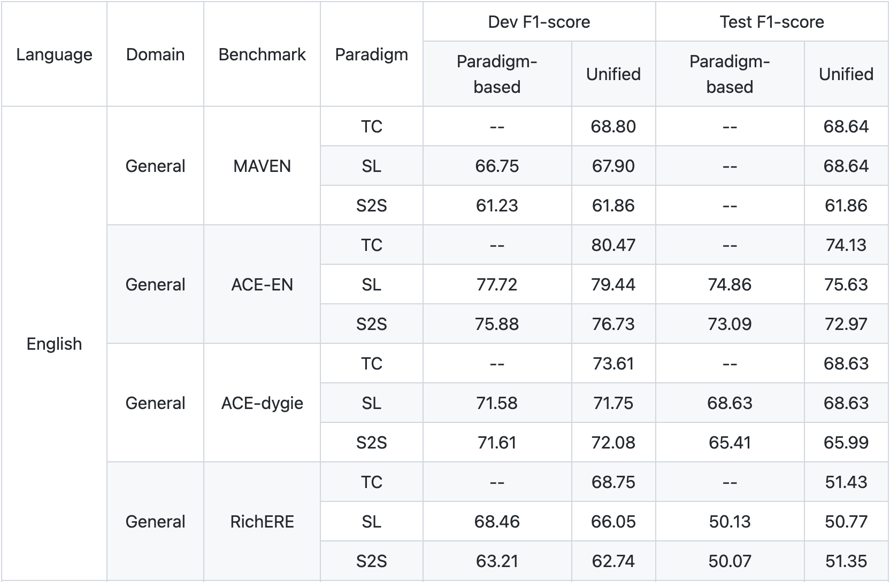
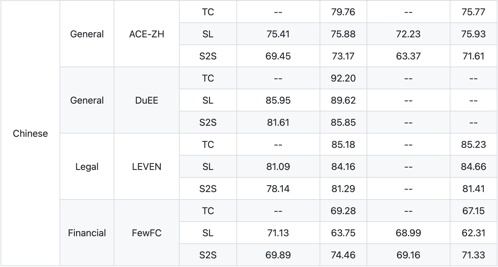

Welcome to OmniEvent's documentation!
=====================================


Overview
--------

OmniEvent is a powerful open-source toolkit for **event extraction**, including **event detection** and
**event argument extraction**. We comprehensively cover various paradigms and provide fair and unified evaluations on
widely-used **English** and **Chinese** datasets. Modular implementations make OmniEvent highly extensible.

Highlights
````````

- **Comprehensive Capability**
    - Support to do **Event Extraction** at once, and also to independently do its two subtasks: **Event Detection**, **Event Argument Extraction**.
    - Cover various paradigms: **Token Classification**, **Sequence Labeling**, **MRC (QA)** and **Seq2Seq**, are deployed.
    - Implement **Transformers-based** (`BERT <https://arxiv.org/pdf/1810.04805.pdf>`_, `T5 <https://arxiv.org/pdf/1910.10683.pdf>`_, etc.) and **classical** models (CNN, LSTM, CRF, etc.) are implemented.
    - Both **Chinese** and **English** are supported for all event extraction sub-tasks, paradigms and models.
- **Modular Implementation**
    - All models are decomposed into four modules:
        - **Input Engineering:** Prepare inputs and support various input engineering methods like prompting.
        - **Backbone:** Encode text into hidden states.
        - **Aggregation:** Fuse hidden states (e.g., select [CLS], pooling, GCN) to the final event representation.
        - **Output Head:** Map the event representation to the final outputs, such as Linear, CRF, MRC head, etc.
- **Unified Benchmark & Evaluation**
    - Various datasets are processed into a `unified format <https://github.com/THU-KEG/OmniEvent/tree/main/scripts/data_processing#unified-omnievent-format>`_.
    - Predictions of different paradigms are all converted into a `unified candidate set <https://github.com/THU-KEG/OmniEvent/tree/main/OmniEvent/evaluation#convert-the-predictions-of-different-paradigms-to-a-unified-candidate-set>`_ for fair evaluations.
    - Four evaluation modes (**gold**, **loose**, **default**, **strict**) well cover different previous evaluation settings.
- **Big Model Training & Inference**
    - Efficient training and inference of big models for event extraction are supported with `BMTrain <https://github.com/OpenBMB/BMTrain>`_.
- **Easy to Use & Highly Extensible**
    - Datasets can be downloaded and processed with a single command.
    - Fully compatible with 🤗 `Transformers <https://github.com/huggingface/transformers>`_ and its `Trainer <https://huggingface.co/docs/transformers/main/en/main_classes/trainer>`_).
    - Users can easily reproduce existing models and build customized models with OmniEvent.

Installation
------------

With pip
````````

This repository is tested on Python 3.9+, Pytorch 1.12.1+. OmniEvent can be installed with pip as follows:

.. code-block:: shell

    pip install OmniEvent

Easy Start
----------

OmniEvent provides ready-to-use models for the users. Examples are shown below.

*Make sure you have installed OmniEvent as instructed above. Note that it may take a few minutes to download checkpoint for the first time.*

.. code-block:: python
    >>> from OmniEvent.infer import infer

    >>> # Even Extraction (EE) Task
    >>> text = "2022年北京市举办了冬奥会"
    >>> results = infer(text=text, task="EE")
    >>> print(results[0]["events"])
    [
        {
            "type": "组织行为开幕", "trigger": "举办", "offset": [8, 10],
            "arguments": [
                {   "mention": "2022年", "offset": [9, 16], "role": "时间"},
                {   "mention": "北京市", "offset": [81, 89], "role": "地点"},
                {   "mention": "冬奥会", "offset": [0, 4], "role": "活动名称"},
            ]
        }
    ]

    >>> text = "U.S. and British troops were moving on the strategic southern port city of Basra \
    Saturday after a massive aerial assault pounded Baghdad at dawn"

    >>> # Event Detection (ED) Task
    >>> results = infer(text=text, task="ED")
    >>> print(results[0]["events"])
    [
        { "type": "attack", "trigger": "assault", "offset": [113, 120]},
        { "type": "injure", "trigger": "pounded", "offset": [121, 128]}
    ]

    >>> # Event Argument Extraction (EAE) Task
    >>> results = infer(text=text, triggers=[("assault", 113, 120), ("pounded", 121, 128)], task="EAE")
    >>> print(results[0]["events"])
    [
        {
            "type": "attack", "trigger": "assault", "offset": [113, 120],
            "arguments": [
                {   "mention": "U.S.", "offset": [0, 4], "role": "attacker"},
                {   "mention": "British", "offset": [9, 16], "role": "attacker"},
                {   "mention": "Saturday", "offset": [81, 89], "role": "time"}
            ]
        },
        {
            "type": "injure", "trigger": "pounded", "offset": [121, 128],
            "arguments": [
                {   "mention": "U.S.", "offset": [0, 4], "role": "attacker"},
                {   "mention": "Saturday", "offset": [81, 89], "role": "time"},
                {   "mention": "British", "offset": [9, 16], "role": "attacker"}
            ]
        }
    ]

Train your Own Model with OmniEvent
---------------------------

OmniEvent can help users easily train and evaluate their customized models on a specific dataset.

We show a step-by-step example of using OmniEvent to train and evaluate an **Event Detection** model on **ACE-EN** dataset in the **Seq2Seq** paradigm.
More examples are shown in `examples <https://github.com/THU-KEG/OmniEvent/examples>`_.

Step 1: Process the dataset into the unified format
```````````````````````````````````````````````````

We provide standard data processing scripts for commonly-adopted datasets. Checkout the details in `scripts/data_processing <https://github.com/THU-KEG/OmniEvent/scripts/data_processing>`_.

.. code-block:: shell

    dataset=ace2005-en  # the dataset name
    cd scripts/data_processing/$dataset
    bash run.sh

Step 2: Set up the customized configurations
````````````````````````````````````````````

We keep track of the configurations of dataset, model and training parameters via a single ``*.yaml`` file. See `/configs <https://github.com/THU-KEG/OmniEvent/configs>`_ for details.

.. code-block:: python

    >>> from OmniEvent.arguments import DataArguments, ModelArguments, TrainingArguments, ArgumentParser
    >>> from OmniEvent.input_engineering.seq2seq_processor import type_start, type_end

    >>> parser = ArgumentParser((ModelArguments, DataArguments, TrainingArguments))
    >>> model_args, data_args, training_args = parser.parse_yaml_file(yaml_file="config/all-datasets/ed/s2s/ace-en.yaml")

    >>> training_args.output_dir = 'output/ACE2005-EN/ED/seq2seq/t5-base/'
    >>> data_args.markers = ["<event>", "</event>", type_start, type_end]

Step 3: Initialize the model and tokenizer
``````````````````````````````````````````
OmniEvent supports various backbones. The users can specify the model and tokenizer in the config file and initialize them as follows.

.. code-block:: python

    >>> from OmniEvent.backbone.backbone import get_backbone
    >>> from OmniEvent.model.model import get_model

    >>> backbone, tokenizer, config = get_backbone(model_type=model_args.model_type,
                                                   model_name_or_path=model_args.model_name_or_path,
                                                   tokenizer_name=model_args.model_name_or_path,
                                                   markers=data_args.markers,
                                                   new_tokens=data_args.markers)
    >>> model = get_model(model_args, backbone)

Step 4: Initialize dataset and evaluation metric
````````````````````````````````````````````````

OmniEvent prepares the ``DataProcessor`` and the corresponding evaluation metrics for different task and paradigms.

.. note::

    **Note that** the metrics here are paradigm-dependent and are **not** used for the final unified evaluation.

.. code-block:: python

    >>> from OmniEvent.input_engineering.seq2seq_processor import EDSeq2SeqProcessor
    >>> from OmniEvent.evaluation.metric import compute_seq_F1

    >>> train_dataset = EDSeq2SeqProcessor(data_args, tokenizer, data_args.train_file)
    >>> eval_dataset = EDSeq2SeqProcessor(data_args, tokenizer, data_args.validation_file)
    >>> metric_fn = compute_seq_F1

Step 5: Define Trainer and train
````````````````````````````````

OmniEvent adopts `Trainer <https://huggingface.co/docs/transformers/main/en/main_classes/trainer>`_ from 🤗 `Transformers <https://github.com/huggingface/transformers>`_) for training and evaluation.

.. code-block:: python

    >>> from OmniEvent.trainer_seq2seq import Seq2SeqTrainer

    >>> trainer = Seq2SeqTrainer(
            args=training_args,
            model=model,
            train_dataset=train_dataset,
            eval_dataset=eval_dataset,
            compute_metrics=metric_fn,
            data_collator=train_dataset.collate_fn,
            tokenizer=tokenizer,
        )
    >>> trainer.train()

Step 6: Unified Evaluation
``````````````````````````

Since the metrics in Step 4 depend on the paradigm, it is not fair to directly compare the performance of different paradigms.

OmniEvent evaluates models of different paradigms in a unifed manner, where the predictions of different models are converted to word-level and then evaluated.

.. code-block:: python

    >>> from OmniEvent.evaluation.utils import predict, get_pred_s2s
    >>> from OmniEvent.evaluation.convert_format import get_trigger_detection_s2s

    >>> logits, labels, metrics, test_dataset = predict(trainer=trainer, tokenizer=tokenizer, data_class=data_class,
                                                        data_args=data_args, data_file=data_args.test_file,
                                                        training_args=training_args)
    >>> # paradigm-dependent metrics
    >>> print("{} test performance before converting: {}".formate(test_dataset.dataset_name, metrics["test_micro_f1"]))
    ACE2005-EN test performance before converting: 66.4215686224377

    >>> preds = get_pred_s2s(logits, tokenizer)
    >>> # convert to the unified prediction and evaluate
    >>> pred_labels = get_trigger_detection_s2s(preds, labels, data_args.test_file, data_args, None)
    ACE2005-EN test performance after converting: 67.41016109045849

For those datasets whose test set annotations are not given, such as MAVEN and LEVEN, OmniEvent provide APIs to generate submission files. See `dump_result.py <https://github.com/THU-KEG/OmniEvent/OmniEvent/evaluation/dump_result.py>`_) for details.

Supported Datasets & Models & Contests
--------------------------------------

Continually updated. Welcome to add more!

Datasets
````````

============ ============= ========== ========================================================
  Language     Domain        Task       Dataset
============ ============= ========== ========================================================
  English      General       ED         `MAVEN <https://github.com/THU-KEG/MAVEN-dataset>`_
  English      General       ED EAE     ACE-EN
  English      General       ED EAE     `ACE-DYGIE <https://aclanthology.org/D19-1585.pdf>`_
  English      General       ED EAE     RichERE (KBP + ERE)
  Chinese      Legal         ED         `LEVEN <https://github.com/thunlp/LEVEN>`_
  Chinese      General       ED EAE     `DuEE <https://www.luge.ai/#/luge/dataDetail?id=6>`_
  Chinese      General       ED EAE     ACE-ZH
  Chinese      Financial     ED EAE     `FewFC <https://github.com/TimeBurningFish/FewFC>`_
============ ============= ========== ========================================================

Models
``````

- Paradigm
    - Token Classification (TC)
    - Sequence Labeling (SL)
    - Sequence to Sequence (Seq2Seq)
    - Machine Reading Comprehension (MRC)
- Backbone
    - CNN / LSTM
    - Transformers (BERT, T5, etc.)
- Aggregation
    - Select [CLS]
    - Dynamic/Max Pooling
    - Marker
    - GCN
- Head
    - Linear / CRF / MRC heads

Contests
````````

OmniEvent plans to support various event extraction contest. Currently, we support the following contests and the list is continually updated!

- `MAVEN Event Detection Challenge <https://codalab.lisn.upsaclay.fr/competitions/395>`_
- `CAIL 2022: Event Detection Track <http://cail.cipsc.org.cn/task1.html?raceID=1&cail_tag=2022>`_
- `LUGE: Information Extraction Track <https://aistudio.baidu.com/aistudio/competition/detail/46/0/task-definition>`_

Experiments
-----------

We implement and evaluate state-of-the-art methods on some popular benchmarks using OmniEvent. The results of all Event Detection experiments are shown in the table below. The full results can be accessed via the links below.

- `Experiments of base models on All ED Benchmarks <https://docs.qq.com/sheet/DRW5QQU1tZ2ViZlFo?tab=qp276f>`_
- `Experiments of base models on All EAE Benchmarks <https://docs.qq.com/sheet/DRW5QQU1tZ2ViZlFo?tab=b0zjme>`_
- `Experiments of All ED Models on ACE-EN+ <https://docs.qq.com/sheet/DRW5QQU1tZ2ViZlFo?tab=odcgnh>`_
- `Experiments of All EAE Models on ACE-EN+ <https://docs.qq.com/sheet/DRW5QQU1tZ2ViZlFo?tab=jxc1ea>`_





.. toctree::
   :maxdepth: 1
   :caption: Tutorials

   tutorials/preprocess

.. toctree::
   :maxdepth: 1
   :caption: Examples

   examples/examples
   examples/bigmodel

.. toctree::
   :maxdepth: 1
   :caption: Input Engineering

   input/tokenizer
   input/whitespace
   input/base
   input/token
   input/labeling
   input/seq2seq
   input/mrc_converter
   input/mrc
   input/utils

.. toctree::
   :maxdepth: 1
   :caption: Backbone

   backbone/backbone

.. toctree::
   :maxdepth: 1
   :caption: Model

   model/model
   model/smoother
   model/constraint

.. toctree::
   :maxdepth: 1
   :caption: Aggregation

   aggregation/aggregation

.. toctree::
   :maxdepth: 1
   :caption: Classification Head

   head/head
   head/classification
   head/crf

.. toctree::
   :maxdepth: 1
   :caption: Evaluation

   evaluation/metric
   evaluation/convert
   evaluation/dump
   evaluation/utils
